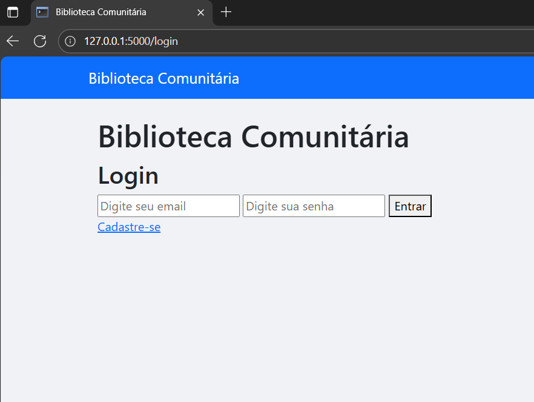
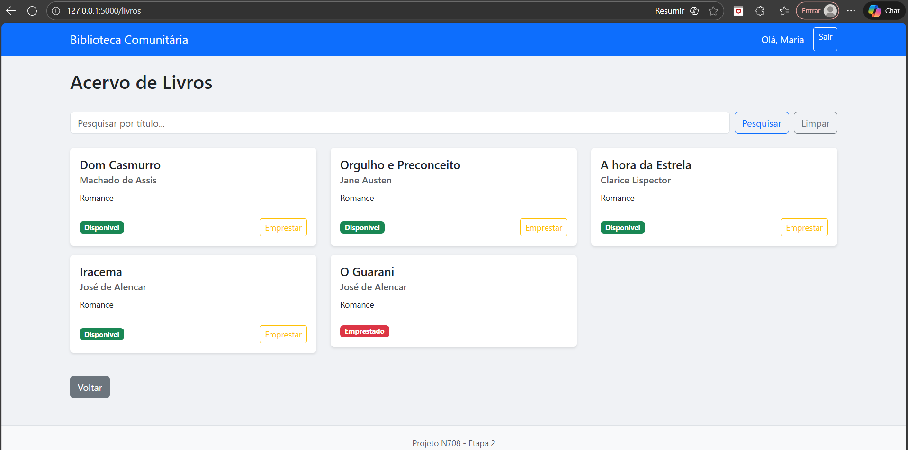
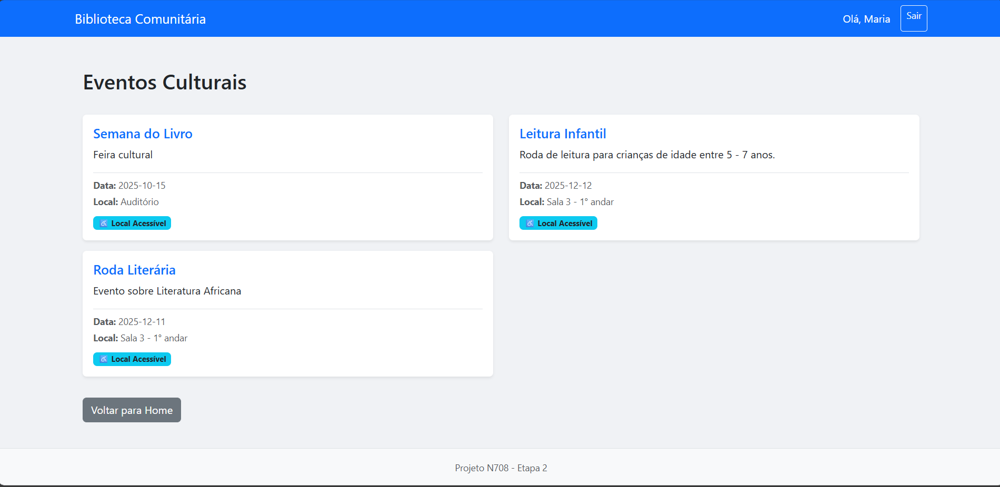

# Sistema de Biblioteca Comunitária - N708

## 1. Título e Descrição do Projeto
**Nome do Sistema:** Gestão de Bibliotecas Comunitárias (GBC)

**Propósito:** Plataforma digital multiplataforma (Web Responsiva) desenvolvida para profissionalizar a gestão de bibliotecas comunitárias em bairros periféricos, facilitando o controle de acervo e a divulgação cultural.

**Problema Solucionado:** Resolve a ineficiência na gestão manual de recursos (livros e eventos) em espaços culturais com recursos limitados, promovendo a inclusão digital e o acesso à informação. O projeto está alinhado ao **ODS 11 (Cidades e Comunidades Sustentáveis)**, visando tornar os equipamentos culturais mais acessíveis e organizados.

---

## 2. Funcionalidades Implementadas

Abaixo, a lista de funcionalidades entregues nesta etapa, com status de implementação:

- [x] **Controle de Acesso:** Login seguro com distinção de perfis (Administrador e Leitor).
- [x] **Gestão de Usuários:** Cadastro de leitores com validação obrigatória de Termos de Uso (LGPD).
- [x] **Gestão de Acervo:** Cadastro, listagem e busca textual de livros em tempo real.
- [x] **Status de Disponibilidade:** Indicador visual imediato (Verde/Vermelho) na listagem de livros, substituindo o cálculo complexo de multas para focar na experiência do usuário.
- [x] **Agenda Cultural:** Divulgação de eventos com informações detalhadas de acessibilidade e local.
- [x] **Interface Responsiva:** Layout adaptável para dispositivos móveis (Smartphones/Tablets) e Desktops.

### Screenshots das Telas Principais
- **Tela de Login:** 
- **Listagem de Livros:** 
- **Painel de Eventos:** 

---

## 3. Tecnologias Utilizadas

### Linguagens e Frameworks
- **Linguagem:** Python 3.10+
- **Backend:** Flask (Microframework)
- **Frontend:** HTML5, CSS3 (Bootstrap 5 via CDN), Jinja2 (Templating Engine)

### Banco de Dados
- **SQLite 3:** Banco de dados relacional serverless (arquivo `.db`). Escolhido pela portabilidade e facilidade de backup em computadores modestos, eliminando a necessidade de servidores dedicados.

### Ferramentas de Desenvolvimento
- **Git/GitHub:** Versionamento de código.
- **VS Code:** Ambiente de desenvolvimento integrado (IDE).
- **Unittest:** Biblioteca nativa do Python para testes automatizados.

---

## 4. Arquitetura do Sistema

### Visão Geral
O sistema adota uma **Arquitetura Monolítica Modular** baseada no padrão **MVT (Model-View-Template)** do Flask. Esta abordagem unifica o backend e a renderização do frontend no servidor, garantindo maior segurança, SEO facilitado e performance em dispositivos antigos.

### Componentes Principais
1.  **Controller (`app.py`):** Gerencia as rotas, autenticação de sessão, lógica de permissões (ACL) e regras de negócio.
2.  **Model (SQLite):** Camada de persistência de dados (Tabelas: Usuários, Livros, Eventos).
3.  **Template (`templates/`):** Gera o HTML dinâmico enviado ao cliente, utilizando Bootstrap para responsividade.

### Integrações
- Integração nativa com sistema de arquivos para persistência do banco de dados (SQLite).
- Integração com CDN do Bootstrap para estilização responsiva automática.

---

## 5. Instruções de Instalação e Execução

### Pré-requisitos
- Python 3.10 ou superior instalado.
- Git instalado.

### Passo a Passo
1.  **Clone o repositório:**
    ```bash
    git clone [https://github.com/](https://github.com/)[SEU_USUARIO]/N708_ProjetoFinal.git
    cd N708_ProjetoFinal
    ```

2.  **Crie e ative o ambiente virtual:**
    * **Windows:**
        ```bash
        python -m venv venv
        .\venv\Scripts\activate
        ```
    * **Linux/Mac:**
        ```bash
        python3 -m venv venv
        source venv/bin/activate
        ```

3.  **Instale as dependências:**
    ```bash
    pip install -r requirements.txt
    ```

4.  **Execute o Sistema:**
    ```bash
    python backend/src/app.py
    ```
    *Nota: O arquivo do banco de dados `biblioteca.db` será criado e populado automaticamente na primeira execução.*

---

## 6. Acesso ao Sistema

Após iniciar o servidor, acesse no seu navegador:
**URL Local:** `http://127.0.0.1:5000`

### Credenciais de Teste
| Perfil | Email | Senha | Permissões |
|---|---|---|---|
| **Administrador** | `admin@email.com` | `admin123` | Cadastrar livros e eventos. |
| **Leitor** | `leitor@email.com` | `123456` | Visualizar acervo e agenda. |

**versão em produção(Railway):** web-production-f806.up.railway.app

---

## 7. Validação com Público-Alvo

### Definição do Público-Alvo
- **Perfil:** Arthur Nogueira Soares (25 anos).
- **Ocupação:** Advogado e morador do bairro Mucuripe (Fortaleza/CE).
- **Contexto:** Representa o usuário final qualificado, que busca acesso à cultura na comunidade mas exige transparência legal e usabilidade.

### Resumo do Processo
A validação ocorreu via videoconferência com demonstração guiada das telas. O foco foi verificar a aderência às necessidades locais e conformidade com a LGPD.

### Principais Feedbacks e Ajustes Realizados
1.  **Feedback Jurídico (LGPD):** "Falta clareza sobre o uso dos dados de endereço no cadastro."
    * **Ajuste Implementado:** Criação de *checkbox* obrigatório de "Termos de Uso" no formulário de cadastro.
2.  **Feedback de Usabilidade:** "Não sei se o livro está na estante só olhando a lista."
    * **Ajuste Implementado:** Inclusão de indicador visual (`Disponível` em verde / `Emprestado` em vermelho) nos cards de livros.
3.  **Feedback de Inclusão:** "Faltam informações de acessibilidade para idosos nos eventos."
    * **Ajuste Implementado:** Adição de campo informativo "Local Acessível" na listagem de eventos.

*Documentação completa, evidências (fotos/termos) e relatório detalhado estão na pasta `validation/` deste repositório.*

---

## 8. Equipe de Desenvolvimento

* **[AYALA RODRIGUES FREIRE]** - Matrícula: [2323803]
    * **Papel:** Desenvolvedor Fullstack e Líder Técnico.
    * **Contribuição:** Implementação do Backend (Python/Flask), Frontend (Bootstrap), Testes Automatizados e Migração de Arquitetura.
